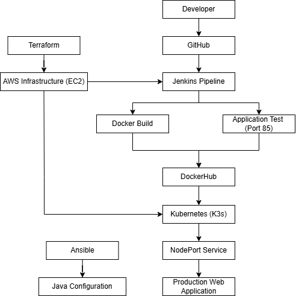
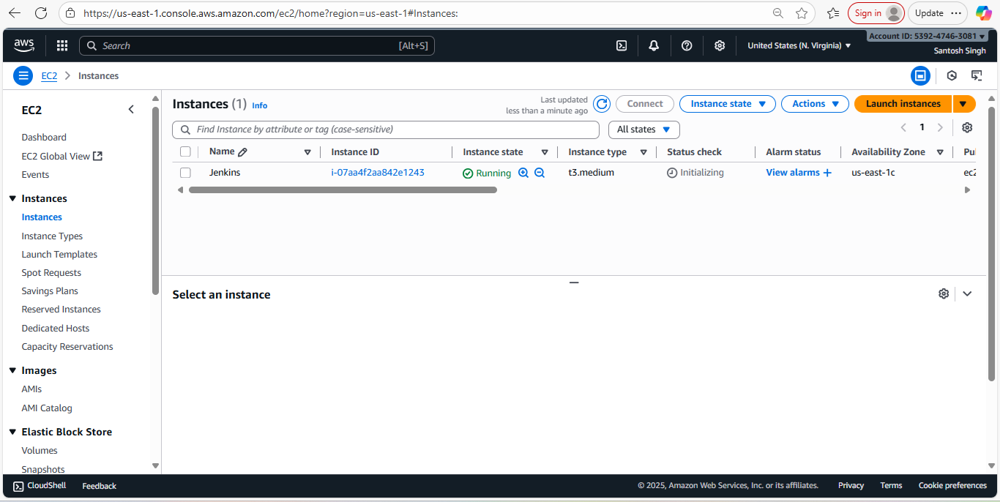
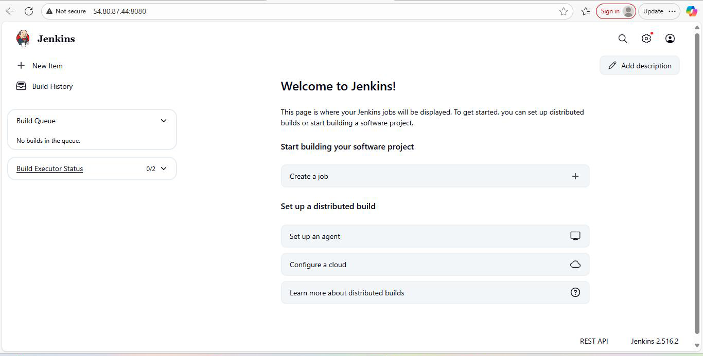
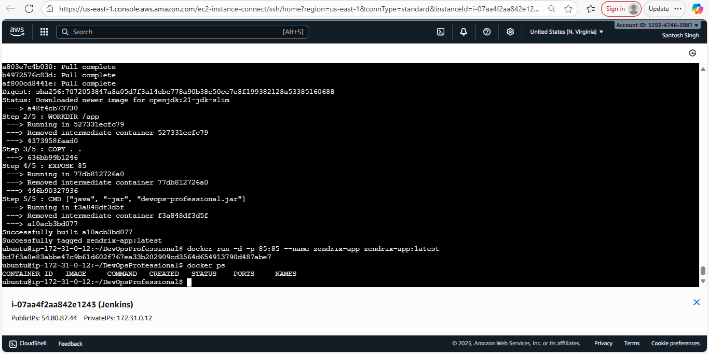
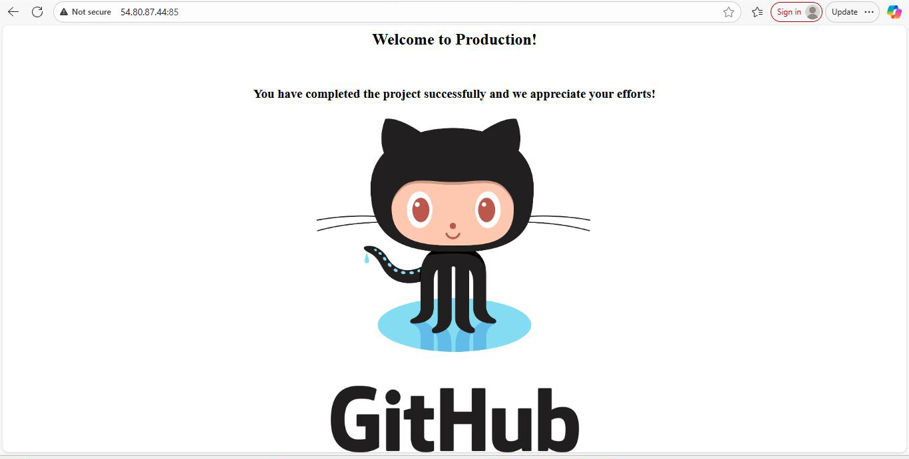
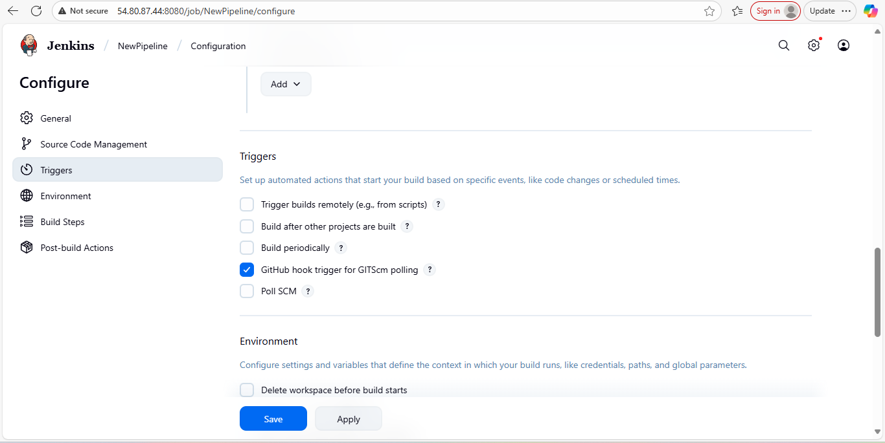
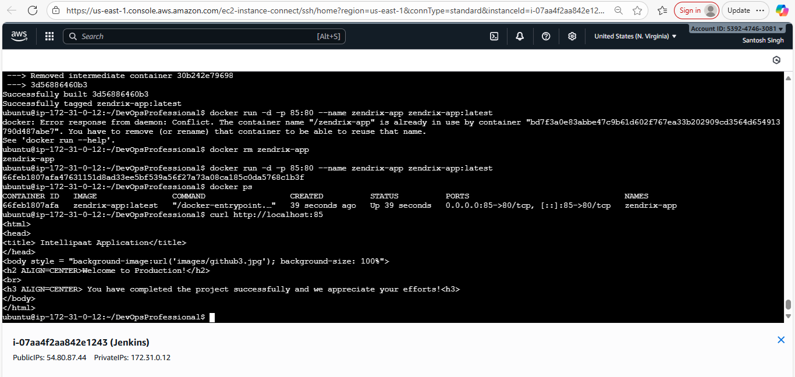
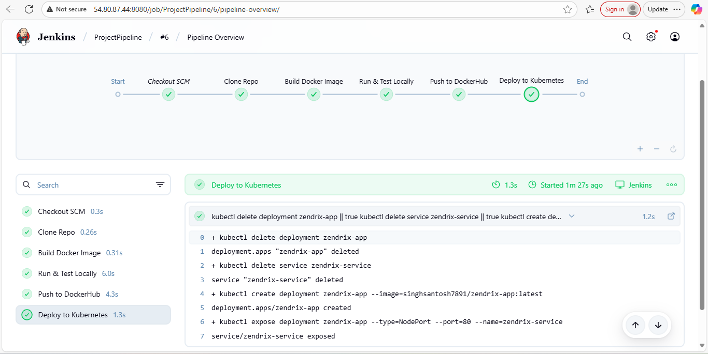

# 🚀 AWS DevOps CI/CD Pipeline Project

## 📌 Project Overview

This project demonstrates the implementation of a complete DevOps CI/CD pipeline on AWS using Docker, Jenkins, Kubernetes (K3s), Terraform, and Ansible.

The objective was to automate the deployment lifecycle from source code management to production deployment while following DevOps best practices.

---

## 🏗 Architecture Diagram



---

## ⚙️ Technology Stack

| Category                 | Technology       |
| ------------------------ | ---------------- |
| Cloud Platform           | AWS EC2          |
| Source Control           | Git & GitHub     |
| CI/CD                    | Jenkins          |
| Containerization         | Docker           |
| Container Registry       | DockerHub        |
| Container Orchestration  | Kubernetes (K3s) |
| Infrastructure as Code   | Terraform        |
| Configuration Management | Ansible          |
| Operating System         | Ubuntu 22.04     |

---

## 🔄 CI/CD Workflow

```text
Developer
    |
    v
GitHub Repository
    |
    v
Jenkins Pipeline
    |
    +-------------------------+
    |                         |
    v                         v
Docker Build         Application Test
                         (Port 85)
    |                         |
    +-----------+-------------+
                |
                v
            DockerHub
                |
                v
        Kubernetes (K3s)
                |
                v
         NodePort Service
                |
                v
      Production Web Application
```

### Pipeline Stages

1. Developer pushes code to GitHub.
2. Jenkins automatically triggers the pipeline.
3. Docker image is built from source code.
4. Application validation is performed on Port 85.
5. Docker image is pushed to DockerHub.
6. Kubernetes pulls the latest image.
7. Application is deployed using Kubernetes Deployment.
8. NodePort Service exposes the application.
9. End users access the application.

---

## ☁️ AWS Infrastructure

### AWS EC2 Configuration

* Ubuntu 22.04 LTS
* t3.medium Instance
* Security Groups configured for:

  * SSH (22)
  * HTTP (80)
  * Application Port (85)
  * Kubernetes NodePort Range (30000-32767)

### Infrastructure Provisioning

Terraform is used to automate infrastructure provisioning and maintain infrastructure as code.

---

## 🐳 Docker Implementation

### Features

* Custom Docker image creation
* Containerized web application deployment
* NGINX-based application hosting
* Automated image build process
* DockerHub image publishing

### Docker Workflow

```text
Source Code
     |
     v
 Docker Build
     |
     v
 Docker Image
     |
     v
 DockerHub
```

---

## 🔧 Jenkins CI/CD Pipeline

### Pipeline Stages

* Checkout SCM
* Clone Repository
* Build Docker Image
* Run Local Validation Test
* Push Image to DockerHub
* Deploy to Kubernetes

### Jenkins Features

* Automated build triggers
* Continuous Integration
* Continuous Deployment
* Automated application testing
* Docker image publishing

---

## ☸ Kubernetes Deployment

### Kubernetes Components

#### Deployment

* Replica-based application deployment
* Self-healing containers
* Rolling updates

#### Service

* NodePort Service
* External application access
* Load balancing across pods

### Verification Commands

```bash
kubectl get nodes
kubectl get pods
kubectl get deployments
kubectl get svc
```

---

## 🏗 Terraform Implementation

### Infrastructure as Code

Terraform is used to:

* Provision AWS Infrastructure
* Create EC2 Resources
* Maintain Infrastructure State
* Automate Environment Creation

### Benefits

* Reusable Infrastructure
* Version Controlled Resources
* Automated Provisioning
* Consistent Deployments

---

## ⚙️ Ansible Implementation

### Configuration Management

Ansible is used to:

* Install OpenJDK 17
* Configure target servers
* Maintain server consistency
* Automate software installation

### Benefits

* Agentless Architecture
* Easy Configuration Management
* Repeatable Deployments
* Automated Administration

---

## 📂 Repository Structure

```text
aws-devops-cicd-pipeline-project
│
├── ansible
│   ├── inventory
│   └── install-java.yml
│
├── architecture
│   └── architecture-diagram.png
│
├── docker
│   └── Dockerfile
│
├── jenkins
│   └── Jenkinsfile
│
├── kubernetes
│   ├── deployment.yaml
│   └── service.yaml
│
├── terraform
│   ├── main.tf
│   ├── variables.tf
│   └── outputs.tf
│
├── screenshots
│   ├── aws-ec2-instance.png
│   ├── jenkins-dashboard.png
│   ├── docker-build-success.png
│   ├── application-running.png
│   ├── jenkins-job-config.png
│   ├── kubernetes-deployment.png
│   └── pipeline-success.png
│
└── README.md
```

---

## 📸 Project Screenshots

### AWS EC2 Instance



### Jenkins Dashboard



### Docker Build Success



### Application Running



### Jenkins Job Configuration



### Kubernetes Deployment



### CI/CD Pipeline Success



---

## 🎯 Key Achievements

✅ End-to-End CI/CD Pipeline Implementation

✅ Dockerized Application Deployment

✅ Kubernetes-Based Container Orchestration

✅ Infrastructure as Code using Terraform

✅ Configuration Management using Ansible

✅ AWS Cloud Infrastructure Deployment

✅ Automated Application Validation

✅ Production-Style Deployment Workflow

---

## 🚀 Future Enhancements

* Amazon EKS
* Helm Charts
* ArgoCD
* GitOps
* Prometheus Monitoring
* Grafana Dashboards
* SonarQube Integration
* Trivy Security Scanning
* AWS ECR Integration
* Blue-Green Deployments
* Canary Deployments

---

## 👨‍💻 Author

### Santosh Singh

Cloud & DevOps Engineer

**Skills:** AWS | Azure | GCP | Docker | Kubernetes | Jenkins | Terraform | Ansible | Linux | GitHub

GitHub: https://github.com/santoshsingh7891

---

⭐ If you found this project useful, consider giving it a star.
